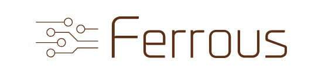

---

# :octopus: The Ferrous-project :octopus:

The aim of this project is to create a fast, scalable pentesting platform.

It integrates existing tools as well as provides own implementations
for some attacks / reconnaissance work.

️:warning: **Caution**:

Please note that this project is under heavy development.
Expect breaking changes every once in a while.

## Single user

If you don't want to have the whole platform deployed, you can just execute `leech` on its own.

With the subcommand `execute`, you can start and configure the modules as they were normal cli utilities.

## Contact

You want to discuss something? Get in touch with us in our [matrix
room](https://matrix.to/#/#ferrous:matrix.hopfenspace.org).